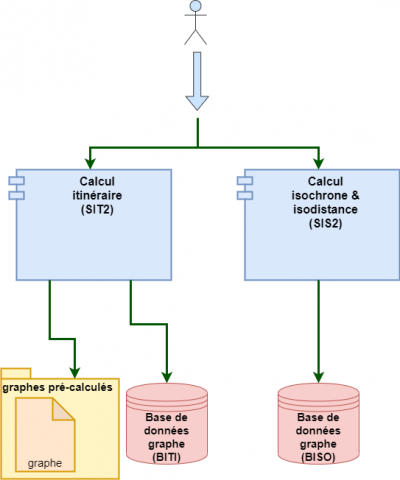

# Road2 et Valhalla

_Road2_ est le moteur de calcul d'itinéraire développé par l'IGN utilisé par le service d'itinéraire et d'isochrone `V2` du Géoportail. Plutôt qu'un moteur en tant que tel, il s'agit plutôt d'un _méta-moteur_ dans la meseure où les calculs d'itinérraires et d'isochrones sont fait par d'autre moteurs open source, auxquels _Road2_ fait appel. En l'occurence, les moteurs actuellement implémentés sur la plateforme sont `OSRM`, un moteur extrêmeent performant au prix d'une configurabilité très limitée, et `pgRouting`, un moteur basé sur la technologie de base de données `PostgreSQL` qui permet à l'utilisateur faisant la requête de paramétrer cette dernière avec un haut niveau de personnalisation, au prix de la performance. Ce dernier moteur est également celui sur lequel se base le service d'isochrone de _Road2_.

## Situation actuelle du déploiement sur la plateforme

### Architecture logique

### Limitations et contournements

Isodistance : 25 km
Isochrone piéton : 6 heures
Isochrone voiture : 11,5 minutes

## Une perspective : Valhalla

### Performances calculées
### Quelques résultats d'isochrones
### Limitations du moteur

## Quelques scénarios
### Scénario 0 : on ne change rien
### Scénario 1 : ajout de Valhalla dans l'architecture logique
#### 1.a : Valhalla sans modification du code source
#### 1.b : Valhalla avec modification du code source
### Scénario 2 : remplacement de pgRouting par Valhalla pour les isochrones
#### 2.a : Valhalla sans modification du code source
#### 2.b : Valhalla avec modification du code source
