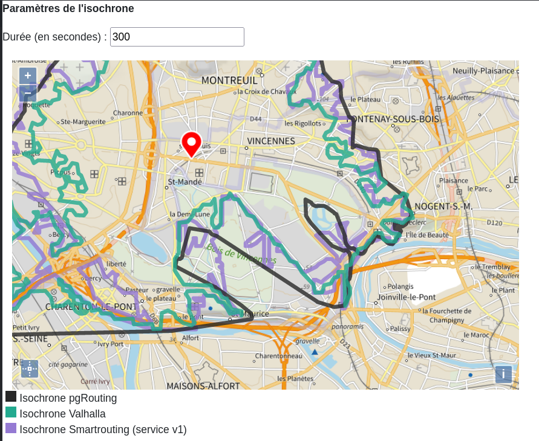

# Road2 et Valhalla

> Pour plus de lisibilité, lorque je ferai mention des _isochrones_, je ferai aussi tacitement mention des _isodistances_.

_Road2_ est le moteur de calcul d'itinéraire développé par l'IGN utilisé par le service d'itinéraire et d'isochrone `V2` du Géoportail. Plutôt qu'un moteur en tant que tel, il s'agit plutôt d'un _proxy de moteurs_ dans la mesure où les calculs d'itinérraires et d'isochrones sont fait par d'autre moteurs open source, auxquels _Road2_ fait appel. En l'occurence, les moteurs actuellement implémentés sur la plateforme sont `OSRM`, un moteur extrêmeent performant au prix d'une configurabilité très limitée, et `pgRouting`, un moteur basé sur la technologie de base de données `PostgreSQL` qui permet à l'utilisateur faisant la requête de paramétrer cette dernière avec un haut niveau de personnalisation, au prix de la performance. Ce dernier moteur est également celui sur lequel se base le service d'isochrone de _Road2_.

Un point important est que ces ont été mis à jour en grande partie parce que la mise à jour des données n'est pas possible sur leur _v1_. Les nouveaux services permettent donc aux utilisateurs de faire des calculs sur des données récentes, mises à jour mensuellement au moement de l'écriture de ce document.

## Situation actuelle du déploiement sur la plateforme


### Architecture logique

Au moment de la définition du déploiement du nouveau service sur OSHIMAE, les limitations en termes de performances de pgRouting, seul moteur de calcul d'isochrones. Ainsi, afin d'éviter qu'une éventuelle surcharge sur le service d'isochrone aie un impact sur le service d'itinéraire, il a été décidé de séparer les deux services sur deux stacks applicatives. Le service d'itinéraire a ainsi deux ressources, l'une basée sur OSRM et et l'autre sur pgRouting, avec une base de données dédiée ; et le service d'isochrone avait initialement une unique ressource basée sur pgRouting avec une base de données dédiée.

### Limitations et contournements

Malgré la séparation des stacks itinéraire et isochrone, cette dernière ne permettait pas une mise en production du service avec les niveaux de sollicitations attendus, du fait de temps de réponse bien trop élevé des requêtes faites sur de grandes distances et grandes durées. D'un autre côté, en inspectant la sollicitation du service d'isochrone _v1_, nous nous sommes rendus compte que la grande majorité des requêtes étaient faites avec des distances et durées suffisamment courtes pour que pgRouting puisse répondre en un temps acceptable. Afin de fournir aux utilisateurs une version plus récente du graphe routier, mais de ne pas rendre impossible le calcul de grandes isochrones, une solution hybride a été mise en place. À partir d'un certain seuil, les isochrones ne sont plus calculées à l'aide du nouveau service, mais à l'aide de l'ancien qui est proxifié par _Road2_.

Les seuils au-dessus desquels un appel à l'ancien service est fait sont les suivants :
  * Isodistance : 25 km
  * Isochrone piéton : 6 heures
  * Isochrone voiture : 11,5 minutes

Cela cause plusieurs problèmes : la différence de moteurs en fonction de la distance ou de la durée crée des incohérences au niveau des résultats. De plus, les données sur lesquelles se basent les isochrones du service _v1_ (et donc au-delà des seuils) n'ont pas été mises à jour depuis 2018. Enfin, les services _v1_ ne vont pas survivre au prochain marché et/ou à la prochaine migration de la plateforme. Dans le cas d'une migration des services d'itnéraire et isochrone, le mécanisme mis en place pour les grandes isochrones ne pourra donc pas être reproduit.

## Une perspective : Valhalla

Un moteur de calcul d'itinéraire et isochrone plutôt récent a pris une certaine ampleur durant le développement de _Road2_ : Valhalla. L'équipe de développement de ce dernier a été intégrée à l'entreprise Mapbox, qui soutient donc activement le projet, après avoir largement contribué au développement d'OSRM. Plus flexible que ce dernier, et plus performant que pgRouting, Valhalla propose, contrairement à OSRM, des méthodes permettant de calculer des isochrones. Ces méthodes sont cependant bien moins paramétrable à la volée que celles de pgRouting.

### Performances calculées

Afin de déterminer le potentiel gain en performance, j'ai développé des scripts de génération de données pour Valhalla à partir de la BDUni, et mis en place dans le code de _Road2_ un moyen de faire appel au moteur. J'ai ensuite réalisé des tirs de performance à l'aide de l'outil _Gatling_ sur deux jeux de données : des isochrones sur des distances plutôt courtes (coût peu élevé), et des isochrones sur des distances plutôt longues (coût élevé, souvent au-delà des seuils décrits ci-dessus).

#### Isochrones avec un coût peu élevé :

Les résultats des tirs de performance sont les suivants :

- Pour pgRouting :
```
================================================================================
---- Global Information --------------------------------------------------------
> request count                                       1010 (OK=1007   KO=3     )
> min response time                                     40 (OK=43     KO=40    )
> max response time                                  14234 (OK=14234  KO=49    )
> mean response time                                   768 (OK=771    KO=45    )
> std deviation                                       1467 (OK=1469   KO=4     )
> response time 50th percentile                        105 (OK=106    KO=47    )
> response time 75th percentile                        770 (OK=796    KO=48    )
> response time 95th percentile                       3784 (OK=3798   KO=49    )
> response time 99th percentile                       6900 (OK=6901   KO=49    )
> mean requests/sec                                  1.012 (OK=1.009  KO=0.003 )
---- Response Time Distribution ------------------------------------------------
> t < 800 ms                                           755 ( 75%)
> 800 ms < t < 1200 ms                                  34 (  3%)
> t > 1200 ms                                          218 ( 22%)
> failed                                                 3 (  0%)
---- Errors --------------------------------------------------------------------
> status.find.in(200,304,201,202,203,204,205,206,207,208,209), b      3 (100,0%)
ut actually found 404
================================================================================
```

- Pour Valhalla :

```
================================================================================
---- Global Information --------------------------------------------------------
> request count                                       1037 (OK=1032   KO=5     )
> min response time                                    173 (OK=173    KO=176   )
> max response time                                   3204 (OK=3204   KO=220   )
> mean response time                                   239 (OK=239    KO=190   )
> std deviation                                        160 (OK=160    KO=16    )
> response time 50th percentile                        203 (OK=204    KO=184   )
> response time 75th percentile                        245 (OK=245    KO=187   )
> response time 95th percentile                        385 (OK=386    KO=213   )
> response time 99th percentile                        566 (OK=567    KO=219   )
> mean requests/sec                                  1.037 (OK=1.032  KO=0.005 )
---- Response Time Distribution ------------------------------------------------
> t < 800 ms                                          1025 ( 99%)
> 800 ms < t < 1200 ms                                   2 (  0%)
> t > 1200 ms                                            5 (  0%)
> failed                                                 5 (  0%)
---- Errors --------------------------------------------------------------------
> status.find.in(200,304,201,202,203,204,205,206,207,208,209), b      5 (100,0%)
ut actually found 404
================================================================================
```

Une sythèse de la distribution des temps de réponse entre les deux moteurs est présentée sur l'histogramme suivant :


Pour les coûts peu élevés, un grand nombre de requêtes faites via pgRouting a un temps de réponse très court : la médiane nous indique que la moitié de ces requêtes prennent moins de 105 millisecondes a être traitées. Cependant, quelques cas moins avantageux étalent grandement la distribution des temps de réponse, et le temps de réponse moyen est situé à 768 ms, tandis que 99% des requêtes ont été traitées en moins de 6900 ms. On constate donc que même pour des distances courtes, il peut y avoir des temps de calculs longs à certaines aoccasions.

En ce qui concernet Valhalla, les temps de réponse sont bien moins étalés, mais ont un temps de traitement minimal à 173 ms. Cela est certainement dû à l'implémentation du moteur à _Road2_. En effet, Valhalla n'a pas de _bindings_ NodeJS, ce qui m'a contraint à passer par un appel à un exécutable au moment de lancer les requêtes. Cette méthode d'appel crée possiblement un _overhead_, ce qui expliquerait la distribution des temps de réponse.

Malgré ce désavantage, au global, Valhalla est plus performant que pgrouting avec un temps de réponse moyen à 239 ms et 99% des requêtes abouties en moins de 566 ms.

#### Isochrones avec un coût élevé :

Les résultats des tirs de performance sont les suivants :
- Pour pgRouting :
```
================================================================================
---- Global Information --------------------------------------------------------
> request count                                        987 (OK=15     KO=972   )
> min response time                                      0 (OK=9432   KO=0     )
> max response time                                  58249 (OK=58249  KO=55330 )
> mean response time                                   658 (OK=30819  KO=193   )
> std deviation                                       5251 (OK=17284  KO=3022  )
> response time 50th percentile                          0 (OK=28787  KO=0     )
> response time 75th percentile                          0 (OK=45140  KO=0     )
> response time 95th percentile                          0 (OK=56729  KO=0     )
> response time 99th percentile                      38793 (OK=57945  KO=0     )
> mean requests/sec                                  0.933 (OK=0.014  KO=0.919 )
---- Response Time Distribution ------------------------------------------------
> t < 800 ms                                             0 (  0%)
> 800 ms < t < 1200 ms                                   0 (  0%)
> t > 1200 ms                                           15 (  2%)
> failed                                               972 ( 98%)
---- Errors --------------------------------------------------------------------
> j.u.c.TimeoutException: Request timeout to proxy.ign.fr/192.16    491 (50,51%)
8.4.9:3128 after 60000 ms
> j.u.c.TimeoutException: Request timeout to proxy.ign.fr/192.16    477 (49,07%)
8.4.22:3128 after 60000 ms
> status.find.in(200,304,201,202,203,204,205,206,207,208,209), b      4 ( 0,41%)
ut actually found 500
================================================================================
```

- Pour Valhalla :
```
================================================================================
---- Global Information --------------------------------------------------------
> request count                                        963 (OK=963    KO=0     )
> min response time                                    350 (OK=350    KO=-     )
> max response time                                  14102 (OK=14102  KO=-     )
> mean response time                                  2603 (OK=2603   KO=-     )
> std deviation                                       1367 (OK=1367   KO=-     )
> response time 50th percentile                       2304 (OK=2304   KO=-     )
> response time 75th percentile                       3171 (OK=3171   KO=-     )
> response time 95th percentile                       5045 (OK=5045   KO=-     )
> response time 99th percentile                       7346 (OK=7346   KO=-     )
> mean requests/sec                                  0.963 (OK=0.963  KO=-     )
---- Response Time Distribution ------------------------------------------------
> t < 800 ms                                            10 (  1%)
> 800 ms < t < 1200 ms                                  45 (  5%)
> t > 1200 ms                                          908 ( 94%)
> failed                                                 0 (  0%)
================================================================================
```

Une sythèse de la distribution des temps de réponse entre les deux moteurs est présentée sur les histogrammes suivants :


Les résultats de pgRouting sont, comme on le savait, très en-deçà des performances attendues : si sur les graphiques on ne voit que très peu ce moteur, c'est que l'écrasante majorité des requêtes (99,58%) sont en erreur du fait d'un temps d'attente supérieur à 60 secondes. C'est précisément la raison pour laquelle actuellement, l'appel au service _v1_ est fait à partir d'un certain seuil. Les requêtes qui aboutissent en moins de 60 secondes le font en un temps toujours supérieur à Valhalla (temps minimal de réponse pour pgRouting : 9432ms alors que 99% des temps de réponse pour Valhalla sont inférieurs à 7346ms).

Le moteur Valhalla, quant à lui, présente des performances acceptables. On rappelera que le calcul d'une isochrone est très lourd, et le temps moyen constaté (2603 millisceondes) est proche de celui du service _v1_ (2708ms). De manière globale, le moteur Valhalla a des performances similaires à l'ancien service, voire meilleures : en effet 95% des requêtes sont résolues en moins de 5045ms pour Valhalla contre 6714ms pour le service _v1_.

Statistiques du jeu de données à coût élevé sur le service _v1_.
```
================================================================================
---- Global Information --------------------------------------------------------
> request count                                       1012 (OK=1009   KO=3     )
> min response time                                    119 (OK=119    KO=3368  )
> max response time                                  13601 (OK=13601  KO=3538  )
> mean response time                                  2708 (OK=2706   KO=3464  )
> std deviation                                       2163 (OK=2166   KO=71    )
> response time 50th percentile                       2281 (OK=2275   KO=3487  )
> response time 75th percentile                       3799 (OK=3801   KO=3513  )
> response time 95th percentile                       6714 (OK=6717   KO=3533  )
> response time 99th percentile                      10235 (OK=10238  KO=3537  )
> mean requests/sec                                  1.008 (OK=1.005  KO=0.003 )
---- Response Time Distribution ------------------------------------------------
> t < 800 ms                                           201 ( 20%)
> 800 ms < t < 1200 ms                                  74 (  7%)
> t > 1200 ms                                          734 ( 73%)
> failed                                                 3 (  0%)
---- Errors --------------------------------------------------------------------
> status.find.in(200,304,201,202,203,204,205,206,207,208,209), b      3 (100,0%)
ut actually found 503
================================================================================
```

Le moteur Valhalla permet donc, d'un point de vue des performances, de suivre la sollicitation, car ses performaces sont légèrement meilleures que celles du service _v1_ et bien meilleures que celle de pgRouting, que ce soit sur les isochrones longues ou même les isochrones courtes, malgré la visible présence d'un _overhead_ de près de 200ms.


### Quelques résultats d'isochrones

La particularité du calcul d'isochrones fait que le résultat visuel peut être très différent d'un moteur à l'autre, du fait de modes de calcul différents. Par exemple, le mode de calcul de pgRouting se fait au niveau des intersections, alors que celui du service _v1_ et celui de Valhalla se basent sur un maillage de l'espace. Il peut donc être intéressant de comparer la "forme" des divers résultats. Ci-après, j'ai comparé la forme d'une isochrone de 300 secondes pour les 3 moteurs différents, avec un zoom sur un détail du résultat ; puis la même chose pour une isochrone de 1800 secondes.





Des retours internes IGN avaient remonté le fait que les isochrones pgRouting étaient trop "convexes" ou "simplifiées par rapport à celles obtenues avec l'ancien service, qui fournissait des surfaces avec un niveau de détail très élevé. Cela peut permettre une meilleur généralisation cartographique, mais fait perdre un certain nombre d'informations avec la perte de précision. Les surfaces en sortie du moteur Valhalla ressemblent à celles du service _v1_ au niveau de la granularité de ses limites, ce qui pourrait répondre aux attentes des habitués du service.

### Limitations du moteur

Le grand avantage du moteur pgRouting, c'est la possibilité de configurer les containtes de circulation grand détail. En plus de l'habituelle restriction possible sur les péages, ponts et tunnels, d'autres nombreux paramètres issus de la BDTopo peuvent être pris en compte. Cette possiblité de faire des contraintes sur des attributs précis n'existe pas dans le moteur Valhalla. De plus, la possibilité de faire des contraintes sur les péages, ponts, et tunnel n'existe pas encore dans le moteur Valhalla, et nécessitera un développement (une _pull request_) de notre part. J'ai posé une question à ce sujet pour savoir si une telle _pull request_ serait acceptée par l'équipe de développement de Valhalla, mais [je n'ai toujours pas eu de réponse](https://github.com/valhalla/valhalla/issues/3587).

Afin de déterminer l'impact d'un passage à Valhalla, j'ai sorti des statistiques sur la sollicitation du service d'isochrones _v2_ et sur l'utilisation du paramètre `constraints` sur deux périodes.

#### Du 13/03 au 30/03

Cette période ne voit que très peu de requêtes faites au service, qui était encore jeune. Ainsi je ne sais pas si l'on peut considérer l'échantillon comme représentatif.

- Requêtes ISO : 309
- Dont contraintes :
  + Pont seul :         8   2,6%
  + Autoroute seul :    4   1,3%
  + Tunnel seul :       0     0%
  + Pont + Tunnel :     3     1%
  + Pt + Tu + toll :    1   0,3%
  + *Autres :            0     0%*

  + **Total :            16     5%**

#### Du 01/04 au 18/04

Cette période pendant laquelle 7 314 requêtes sont faites au service est marquée par plusieurs grands pics de sollicitation issus d'une seule adresse IP. De fait, la sollicitation concerne majoritairement(69%) un seul utilisateur, et n'est donc pas représentative (mais pour des raisons différentes de la période précédente). Sur les 6923 requêtes faites sur cette période, seules 44 comportent des contraintes, soit 0.6%. L'utilisateur réprésentant 69% des requêtes n'utilisant pas la fonctionnalité, j'ai sorti les statistiques suivantes en retirant les requêtes qu'il a faites.

- Requêtes ISO : 889
- Dont contraintes :
  + Pont seul :        44     5%
  + Autoroute seul :    0     0%
  + Tunnel seul :       0     0%
  + Pont + Tunnel :     0     0%
  + Pt + Tu + toll :    0     0%
  + *Autres :           0     0%*

  + **Total :            44     5%**

#### Conculsions sur l'utilisation des contraintes

Dans sa version actuelle, le service d'isochrone _v2_ permet de paramétrer des contraintes sur des attributs divers de le BDTopo. Cette fonctionnalité n'est absolument pas utilisée. Les seules contraintes qui sont dans les requêtes faites par les utilisateurs concernent les attributs historiques : pont, péages et tunnels. Bien qu'elles soient utilisés, ces contraintes ne le sont que par une petite minorité des requêtes faites au service.

## Quelques scénarios

Au regard de ce que j'ai décrit jusqu'ici, j'ai imaginé plusieurs scénarios par raport au service d'isochrone _v2_.

### Scénario 0 : on ne change rien
### Scénario 1 : ajout de Valhalla dans l'architecture logique
#### 1.a : Valhalla sans modification du code source
#### 1.b : Valhalla avec modification du code source
### Scénario 2 : remplacement de pgRouting par Valhalla pour les isochrones
#### 2.a : Valhalla sans modification du code source
#### 2.b : Valhalla avec modification du code source

## Informations complémentaires
### Pourquoi ne pas utiliser Valhalla pour les itinéraires ?
